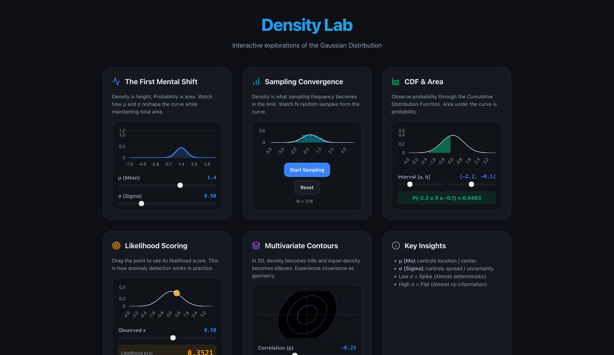

# Density Lab: Interactive Gaussian Visualizer



A premium, interactive web application designed to build a deep intuition for continuous probability distributions, specifically the Gaussian (Normal) distribution.

## 🌟 Features

### 1. The First Mental Shift
- **Intuition**: Density ≠ Probability.
- **Interactive**: Sliders for $\mu$ (mean) and $\sigma$ (standard deviation) show how the "height" (density) changes while the "area" (probability) remains 1.

### 2. Sampling Convergence
- **Intuition**: Density is what sampling frequency becomes in the limit.
- **Interactive**: Generate random samples in real-time and watch the histogram converge to the theoretical PDF ($p(x)$).

### 3. CDF & Area Highlighting
- **Intuition**: $P(a \leq X \leq b) = \int_{a}^{b} p(x) dx$.
- **Interactive**: Drag interval boundaries and see the shaded area calculate the cumulative probability.

### 4. Likelihood Scoring
- **Intuition**: Density as a "Normality Score".
- **Interactive**: Drag a point along the axis to see its likelihood. Highlights how anomaly detection is mathematically grounded in density values.

### 5. Multivariate Gaussian (2D)
- **Intuition**: Covariance is Geometry.
- **Interactive**: Adjust correlation ($\rho$) and observe how the density "hills" tilt and stretch into ellipses.

## 🚀 Tech Stack
- **Framework**: React (Vite)
- **Styling**: Vanilla CSS (Modern design system, Dark Mode, Glassmorphism)
- **Plotting**: [Chart.js](https://www.chartjs.org/) + [react-chartjs-2](https://react-chartjs-2.js.org/)
- **Math**: Box-Muller transform for sampling, Error Function approximations for CDF.

## 🛠️ Getting Started

```bash
# Clone the repository
git clone https://github.com/VicoErv/density-lab.git

# Install dependencies
npm install

# Start development server
npm run dev

# Build for production
npm run build
```

## 📜 License
MIT
